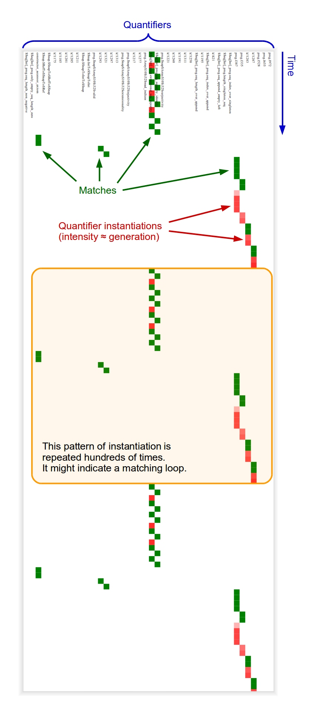

# QI Explorer

This script generates CSV/SVG/PNG/MIDI files to explore the quantifier instantiations of a Z3 trace, (hopefully) helping to identify matching loops. See below for an example.

* The **CSV** file lists the quantifier and generation of each instantiation, in the same order as they appear in the Z3 trace.
* The **SVG and PNG** images visualize the order in which the quantifiers are matched and instantiated. Each quantifier is associated with a column and time progresses downwords. Each match is a green square and each instantiation is a red square, whose color intensity represents the generation of the instantiation.
* The **MIDI** file represents just the quantifier instantiations. Each quantifier is associated with a pitch and each instantiation generates a note whose volume increases with the generation of the instantiation.

## Requirements

Python 3.6 or later.

Optionally, to generate the SVG/PNG/MIDI files:

```
pip install --user svgwrite==1.4.2 cairosvg==2.5.2 midiutil==1.2.1
```

## Usage

```text
usage: python script.py [-h] [-i INPUT] [--csv CSV] [--svg SVG] [--png PNG] [--midi MIDI]
                        [--max-instantiations MAX_INSTANTIATIONS]
                        [--skip-instantiations SKIP_INSTANTIATIONS] [--tempo TEMPO]

Explore quantifier instantiations.

optional arguments:
  -h, --help            show this help message and exit
  -i INPUT, --input INPUT
                        path of the Z3 trace (default: read from stdin)
  --csv CSV             output path of the CSV file
  --svg SVG             output path of the SVG file
  --png PNG             output path of the PNG file
  --midi MIDI           output path of the MIDI file
  --max-instantiations MAX_INSTANTIATIONS
                        maximum number of quantifier instantiations to load (default: all)
  --skip-instantiations SKIP_INSTANTIATIONS
                        number of *loaded* quantifier instantiations to skip (default: 0)
  --tempo TEMPO         beats per minute (default: 480)
```

## Example

Command:
```bash
python script.py \
    --input z3.log \
    --max-instantiations 5500 \
    --skip-instantiations 5000 \
    --csv example/example.csv \
    --svg example/example.svg \
    --midi example/example.mid
```

Output:
```text
Loading trace file 'z3.log'...
Tool version: Z3 4.8.6
Only the first 5500 quantifier instantiations will be loaded.
Number of quantifiers: 222
Number of used quantifiers: 42
Number of unique matches: 1274
Number of quantifier instantiations: 5500
Creating CSV file at 'example/example.csv'...
CSV file created
Creating SVG image...
The first 5000 quantifier instantiations will be ignored.
SVG image created
Creating SVG file at 'example/example.svg'...
SVG file created
Creating MIDI file at 'example/example.mid'...
MIDI file created
```

Generated files: [`example.csv`](example/example.csv), [`example.svg`](example/example.svg), [`example.mid`](example/example.mid)

Explanation of the generated image:


## How to generate the Z3 trace

To generate a `z3.log` file:

```bash
z3 trace=true smt.qi.profile=true smt.qi.profile_freq=10000 program.smt2
```

The `smt.qi.profile=true smt.qi.profile_freq=10000` arguments make Z3 periodically report the number of quantifier instantiations, which is usefuly if you want to check the progress or kill Z3 when too many quantifiers have been instantiated.

## References

* [Z3](https://github.com/Z3Prover/z3)
* [Axiom Profiler](https://github.com/viperproject/axiom-profiler)
* [Instantiation of a quantifier in Z3](https://github.com/Z3Prover/z3/blob/90fd3d82fce20d45ed2eececdf65545bab769503/src/sat/smt/q_queue.cpp#L139)
* [How the Axiom Profiler parses the Z3 trace](https://github.com/viperproject/axiom-profiler/blob/95a021af057b4d22510e213902a4ce604c569459/source/LogProcessor.cs#L898)
